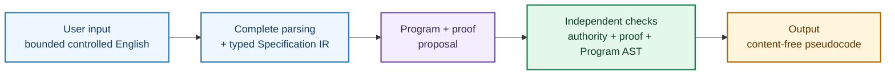
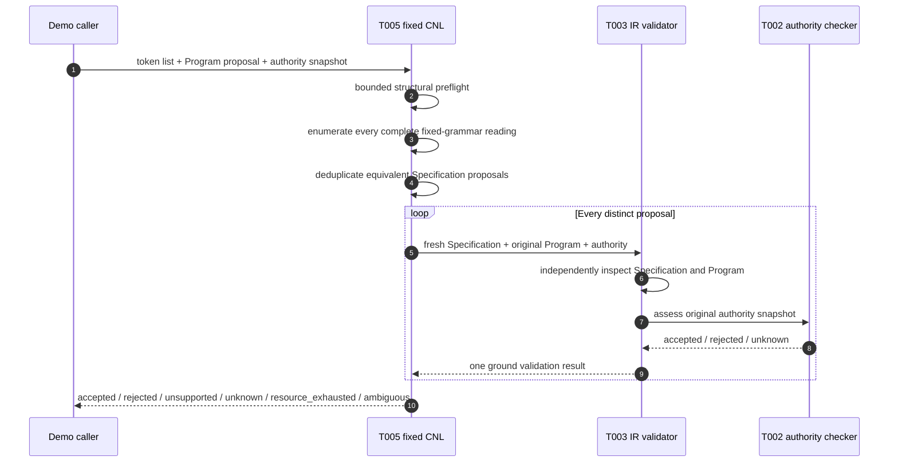
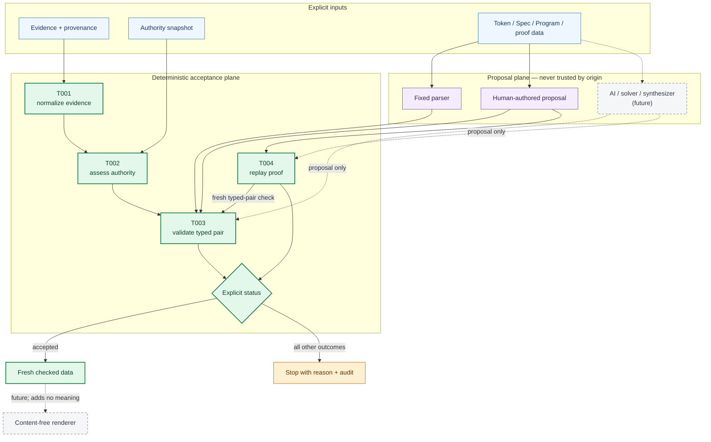
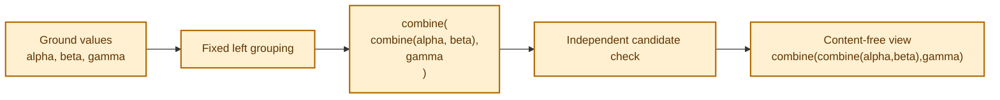

# Controlled Program Synthesis

> A SWI-Prolog research prototype for turning tightly bounded specification
> data into independently checked results. It is deliberately **not** a
> general English-to-code system yet.

Controlled Program Synthesis (CPS) explores a simple but demanding idea: a
parser, synthesizer, solver, proof assistant, or AI may propose an artifact,
but a proposal never becomes trusted merely because it was generated. Every
accepted result must cross a finite, deterministic, source-relative checking
boundary.

## The overall picture

A finished CPS interaction is intended to feel like this:



> **Important:** the examples below illustrate the intended user experience;
> they are not an accepted end-to-end interface. The exact one-to-three-value
> mappings exist only in the unaccepted T006 candidate. Today, the completed
> T005 boundary stops at validated Specification IR and emits no pseudocode.

**PROJECT INTERPRETATION —** Read these examples as an orientation aid, not a
syntax or compatibility promise. The input is shown as space-separated token
atoms; the output is a content-free expression rather than executable code.

### Example A — one value needs no operation

User input (controlled English):

```text
specification reduce_spec
program reduce_program
reduces sequence alpha
as item from left
using operation combine
in definition_space combine_space
using premise combine_premise
```

Intended pseudocode expression:

```text
alpha
```

### Example B — combine two values

User input (controlled English):

```text
specification reduce_spec
program reduce_program
reduces sequence alpha then beta
as item from left
using operation combine
in definition_space combine_space
using premise combine_premise
```

Intended pseudocode expression:

```text
combine(alpha,beta)
```

### Example C — the grouping is explicitly left-to-right

User input (controlled English):

```text
specification reduce_spec
program reduce_program
reduces sequence alpha then beta then gamma
as item from left
using operation combine
in definition_space combine_space
using premise combine_premise
```

Intended pseudocode expression:

```text
combine(combine(alpha,beta),gamma)
```

The third result preserves the requested grouping. It is not silently changed
to `combine(alpha,combine(beta,gamma))`, balanced, parallelized, or executed.
Even in the intended complete system, pseudocode would be emitted only after
the original authority snapshot, proof, and independently reconstructed
Program AST had all been accepted. Missing evidence would produce an explicit
non-accepting status instead of guessed code.

The repository currently contains completed, narrow slices for evidence
normalization, authority assessment, typed equality proposals, identity-proof
replay, and one fixed controlled-English fragment. A reduction candidate also
exists, but its T006 workflow is blocked and its amended plan is unapproved;
it is not an accepted capability.

## Status at a glance

**SOURCE FACT —** The canonical task records mark T001 through T005 `DONE`.
They mark T006 `BLOCKED` with no eligible step while an amended plan awaits an
owner decision. T007 and T008 remain backlog work.

**PROJECT INTERPRETATION —** `DONE` means that one bounded task contract
completed its governed workflow. It does not mean that the overall system is
finished, production-ready, or generally intelligent.

```mermaid
flowchart LR
    P0["Phase 0<br/>bootstrap"] --> T1["T001<br/>evidence normalization"]
    T1 --> T2["T002<br/>authority assessment"]
    T2 --> T3["T003<br/>typed equality IR"]
    T3 --> T4["T004<br/>identity-proof replay"]
    T4 --> T5["T005<br/>fixed CNL fragment"]
    T5 -. "candidate exists;<br/>approval does not" .-> T6["T006<br/>fixed-left reduction"]
    T6 -. "future dependency" .-> T7["T007/T008<br/>later research"]

    classDef done fill:#d9fbe5,stroke:#177245,color:#0b3d24,stroke-width:2px;
    classDef blocked fill:#fff0d2,stroke:#b26a00,color:#5e3500,stroke-width:2px;
    classDef future fill:#edf1f7,stroke:#697386,color:#303846,stroke-width:1.5px,stroke-dasharray:5 4;
    class P0,T1,T2,T3,T4,T5 done;
    class T6 blocked;
    class T7 future;
```



| Slice | Bounded capability | Workflow state | What that does **not** establish |
| --- | --- | --- | --- |
| Phase 0 | Reports the bootstrap stage | Implemented | Any domain behavior |
| T001 | Validates and normalizes immutable evidence terms syntactically | `DONE` | Semantic truth or legacy runtime behavior |
| T002 | Assesses one closed, source-relative law-claim authority snapshot | `DONE` | Truth outside the supplied snapshot |
| T003 | Validates one ground typed-equality Specification proposal and one identity-shaped Program proposal | `DONE` | Equality truth, execution, or general correctness |
| T004 | Replays one bounded source-relative identity proof proposal | `DONE` | Proof search, theorem discovery, or Program execution |
| T005 | Parses one fixed pre-tokenized equality fragment and freshly delegates to T003 | `DONE` | General English, synthesis, proof, or rendering |
| T006 | Unaccepted fixed-left-reduction source and tests | `BLOCKED`; amended plan unapproved | An accepted synthesizer, checker, or renderer |
| T007/T008 | Teaching lifecycle and technology qualification | `PENDING` | Implemented behavior |

The [canonical source component matrix](src/README.md) describes ownership and
the exact boundary of each published module.

## A 60-second tour

### 1. Prerequisite

This checkout was verified with SWI-Prolog 10.0.2. Other versions may work,
but have not been checked here.

```sh
git clone https://github.com/gellertbalazs/controlled-program-synthesis.git
cd controlled-program-synthesis
swipl --version
```

There is no build step and no package installation step for the published
Prolog modules.

### 2. Ask the bootstrap what exists

From the repository root:

```sh
swipl -f none -q -s src/cps_bootstrap.pl \
  -g "cps_bootstrap:bootstrap_stage(Stage),write_canonical(Stage),nl,halt"
```

Expected output:

```text
phase0
```

The answer is intentionally modest. The repository is still Phase 0 even
though several small domain boundaries now exist.

### 3. Watch malformed evidence fail closed

This call deliberately supplies an atom where T001 expects a structured
evidence term:

```sh
swipl -f none -q -s src/cps_reference_normalization.pl \
  -g "cps_reference_normalization:normalize_reference_evidence(foo,R),write_canonical(R),nl,halt"
```

Expected output:

```text
normalization(rejected(malformed_shape),none)
```

That rejection is a successful demonstration. The validator returns an
explicit, ground result rather than guessing, executing the input, or silently
coercing it.

### 4. Run one accepted controlled-English case

T005 recognizes this exact 20-token shape:

```prolog
[
    specification, spec_main,
    binds, spec_object,
    as, element,
    and, requires,
    equality, represented_equal,
    for, spec_object,
    equals, value,
    in, definition_space, adjacent_defined,
    using, premise, adjacent_applications
]
```

Read with spaces, it says:

```text
specification spec_main binds spec_object as element
and requires equality represented_equal
for spec_object equals value
in definition_space adjacent_defined
using premise adjacent_applications
```

This is a machine language with English-like keywords, not free-form English.
The complete accepted example also supplies a compatible identity-shaped
Program proposal and a source-relative authority snapshot. Run the existing
executable fixture:

```sh
swipl -f none -q -s tests/unit/controlled_english_v0_unit_tests.pl \
  -g "run_tests([cps_controlled_english_v0:base_sentence_accepts_exact_fresh_t003_result]),halt"
```

The test exits successfully only if T005 returns the fresh validated payload
below and its audit records the complete parse and nested T003/T002 result:

```prolog
validated_specification(
    specification_id(spec_main),
    nominal_type(type_id(element)),
    scoped_equality(
        object_binder(
            binder_id(spec_object),
            type_id(element)),
        equality_relation(
            equality_id(represented_equal),
            object_reference(
                binder_id(spec_object),
                type_id(element)),
            object_value(
                atom_value(value),
                type_id(element)))),
    definition_space_id(adjacent_defined),
    premise_id(adjacent_applications)
)
```

The larger accepted fixture is intentional: authority, provenance, Program
shape, and premise identity stay explicit instead of being hidden behind
defaults. See the
[T005 unit test](tests/unit/controlled_english_v0_unit_tests.pl) for every
input byte and every assertion.

## What happens in the T005 demonstration



The important detail is the direction of authority: parser output flows into
the checker. Parser output does not tell the checker that it has already been
accepted.

## The trust model

**PROJECT INTERPRETATION —** The long-term architecture separates development,
proposal/search, deterministic acceptance, and content-free rendering. The
current repository implements only the narrow solid-line boundaries shown
below; the dashed proposal backends and final renderer are future work.



An `accepted` result is always relative to the exact checked fragment,
premises, provenance, bounds, and checker contract. It is not a claim that the
system understood arbitrary intent or proved unrestricted program
correctness.

## Public bounded APIs

| Module | Public predicate | Result envelope | Exact role |
| --- | --- | --- | --- |
| [Bootstrap](src/cps_bootstrap.pl) | `bootstrap_stage/1` | `phase0` | Reports the implemented project stage |
| [T001 normalization](src/cps_reference_normalization.pl) | `normalize_reference_evidence/2` | `normalization(Status, Normalized)` | Syntactically validates immutable, source-addressed evidence |
| [T001 comparison](src/cps_reference_normalization.pl) | `reference_normalization_equal/3` | `equality(Status)` | Compares complete normalization results structurally |
| [T002 authority](src/cps_law_claim_authority.pl) | `assess_law_claim_authority/2` | `authority_assessment(Status, Audit)` | Checks one closed, one-hop source-relative authority snapshot |
| [T003 typed pair](src/ir/cps_ground_typed_equality_ir.pl) | `validate_ground_typed_equality_pair/4` | `ground_typed_equality_validation(Status, Audit)` | Checks one Specification proposal and a distinct identity-shaped Program proposal |
| [T004 replay](src/verification/cps_source_relative_identity_replay.pl) | `check_source_relative_identity_proof/5` | `proof_replay(Status, Audit)` | Replays one supplied identity proof against fresh predecessor checks |
| [T005 CNL](src/cnl/cps_controlled_english_v0.pl) | `validate_controlled_english_v0/4` | `controlled_english_validation(Status, Audit)` | Parses the fixed token fragment and validates every distinct proposal through T003 |

T001 through T005 treat caller inputs as data. Their approved input-mode
contracts are bounded, avoid mutating the supplied terms, and return explicit
results. Exact constructors, limits, priority rules, and audit fields are
documented beside the modules and exercised in their unit tests.

### Outcome vocabulary

The exact envelope varies by boundary, but later slices deliberately preserve
these meanings:

| Outcome | Meaning |
| --- | --- |
| `accepted(...)` | The artifact satisfied this exact bounded checker contract |
| `rejected(...)` | Inspected evidence showed a malformed, inconsistent, forbidden, or negative condition |
| `unsupported(...)` | The input was well-shaped enough to identify a feature outside the approved fragment |
| `unknown(...)` | Required evidence was missing or insufficient; the checker did not guess |
| `resource_exhausted(...)` | A declared bound prevented the next observation |
| `ambiguous(...)` | Multiple distinct validated readings remained |

Not every predicate uses every outcome family. No non-accepting outcome is a
license to publish or execute a proposal.

## T006 preview: the idea, not an accepted feature

**SOURCE FACT —** A T006 candidate source file and tests exist in the
repository, but the archived delivery attempt is blocked and the amended
ExecPlan is unapproved. No T006 step is eligible. The
[candidate module](src/cps_fixed_left_reduction_v0.pl) is therefore not a
supported public API.

**PROJECT INTERPRETATION —** It is safe to use the following as a visual
preview of the intended bounded slice, not as evidence that synthesis or
rendering has been accepted.



The proposed slice is intentionally tiny: one nonempty sequence, one fixed
`combine` constructor, one to three ground values, and fixed left nesting. It
does not authorize arbitrary operations, reassociation, balancing, parallel
reduction, lambda reduction, execution, or a general renderer.

## Safety properties being built

- **Source-relative trust.** Used premises must be active and trusted under
  the supplied policy and provenance; a name or shared identifier is not
  authority by itself.

- **Proposal/acceptance separation.** Specifications, Programs, proofs,
  parser output, solver output, and future AI output remain proposals until an
  independent checker reconstructs accepted data.

- **Fail-closed outcomes.** Malformed, cyclic, non-ground, unsupported,
  ambiguous, missing-evidence, and resource cases are surfaced explicitly at
  the boundaries where they apply.

- **Finite observation.** List lengths, scalar lengths, nesting depth,
  inspected cells, proof structure, and process time are bounded by the
  owning slice rather than left implicit.

- **Inputs stay data.** User and knowledge terms are not passed to arbitrary
  `call/1`, `assert/1`, `assertz/1`, `retract/1`, or equivalent
  meta-execution/database mutation.

- **Rendering adds no meaning.** A future accepted renderer may expose only
  independently checked Program-AST structure. It may not invent, repair, or
  select semantics.

These are fragment-relative engineering guarantees, not absolute guarantees
of intent understanding, truth, correctness, termination, or hallucination
freedom.

## What is deliberately not here yet

- no tokenizer or general controlled-English parser;
- no general synthesis or search algorithm;
- no arbitrary theorem prover or proof construction engine;
- no Program execution runtime;
- no accepted general renderer, code generator, or target language;
- no mutable knowledge lifecycle or teaching dialogue;
- no persistence, service, network, supervisor, or worker protocol;
- no qualified SMT, SyGuS, proof-assistant, equality-saturation, or AI
  backend.

Keeping these absences visible is part of the demonstration: the project
prefers an honest `unknown`, `unsupported`, or blocked workflow state to an
unearned success claim.

## Testing the published modules

Each public boundary has a focused PlUnit file. These commands need only the
published source and test tree:

```sh
swipl -f none -q -s tests/unit/bootstrap_unit_tests.pl \
  -g "run_tests,halt"

swipl -f none -q -s tests/unit/reference_normalization_unit_tests.pl \
  -g "run_tests,halt"

swipl -f none -q -s tests/unit/law_claim_authority_unit_tests.pl \
  -g "run_tests,halt"

swipl -f none -q -s tests/unit/ground_typed_equality_ir_unit_tests.pl \
  -g "run_tests,halt"

swipl -f none -q -s tests/unit/source_relative_identity_replay_unit_tests.pl \
  -g "run_tests,halt"

swipl -f none -q -s tests/unit/controlled_english_v0_unit_tests.pl \
  -g "run_tests,halt"
```

### Optional tracked-tree integration inventory

Clean-process integration coverage lives in
[tests/integration/bootstrap_integration_tests.pl](tests/integration/bootstrap_integration_tests.pl).
The historical filename is narrower than its present coverage, which includes
the unaccepted T006 candidate as well as completed boundaries. Running this
file does not make T006 accepted or change its blocked workflow state.

```sh
swipl -f none -q -s tests/integration/bootstrap_integration_tests.pl \
  -g "run_tests,halt"
```

### Maintainer-only quality gates

The full maintainer checkout also contains intentionally unpublished workflow
scripts, manifests, task records, and the five immutable local references.
In that checkout, the documented gate sequence is:

```text
swipl -f none -q -s scripts/doctor.pl
swipl -f none -q -s scripts/test_unit.pl
swipl -f none -q -s scripts/test_integration.pl
swipl -f none -q -s scripts/test.pl
swipl -f none -q -s scripts/check.pl
```

`scripts/check.pl` is the canonical repository gate. A successful command is
evidence for the exact checked bytes and workflow state, not a permanent
waiver for later changes or warnings.

## Repository map

```text
controlled-program-synthesis/
├── src/
│   ├── cps_reference_normalization.pl       # T001
│   ├── cps_law_claim_authority.pl           # T002
│   ├── ir/                                  # T003
│   ├── verification/                        # T004
│   ├── cnl/                                 # T005
│   ├── cps_fixed_left_reduction_v0.pl       # unaccepted T006 candidate
│   ├── synthesis/                           # reserved
│   ├── rendering/                           # reserved
│   └── dialogue/                            # reserved
├── tests/
│   ├── unit/                                # boundary and interaction matrices
│   └── integration/                         # fresh-process behavior
├── docs/
│   ├── architecture/                        # trust and component design
│   ├── decisions/                           # architecture decisions
│   ├── evaluation/                          # evaluation strategy
│   └── reference/                           # evidence orientation
├── knowledge/                               # reserved governed knowledge areas
├── benchmarks/                              # reserved versioned corpora
└── references/README.md                     # roles of unpublished immutable inputs
```

The five local research inputs comprise one NLP/Prolog text, two legacy Prolog
artifacts, and two *Elements of Programming* references. They are immutable,
intentionally unpublished, and checked by path, size, and SHA-256 in the full
maintainer environment. The legacy Prolog files are inspected only as inert,
line-addressable evidence; they are not consulted or loaded as product
modules.

## How to read project claims

The repository uses four evidence labels so that fact, interpretation, and
open design work do not blur together:

| Label | Meaning |
| --- | --- |
| `SOURCE FACT` | Directly established by a cited source, repository artifact, or recorded check |
| `PROJECT INTERPRETATION` | The project's bounded reading or engineering consequence of source facts |
| `PROPOSED DECISION` | A reviewable choice that is not yet approved authority |
| `HYPOTHESIS` | An unresolved claim that requires evidence; often explicitly `UNKNOWN` |

## Navigation

- [Architecture overview](docs/architecture/README.md)
- [Safety and decision records](docs/decisions/README.md)
- [Evaluation boundary](docs/evaluation/README.md)
- [Reference orientation](docs/reference/README.md)
- [Immutable reference roles](references/README.md)
- [Canonical source component matrix](src/README.md)
- [Controlled-language contract](src/cnl/README.md)
- [Intermediate-representation contract](src/ir/README.md)
- [Verification contract](src/verification/README.md)
- [Test layout](tests/README.md)
- [Knowledge-area map](knowledge/README.md)
- [Future benchmark area](benchmarks/README.md)

## License

No license or copyright grant has been added. Unless and until that changes,
do not assume permission to copy, modify, or redistribute the repository.
